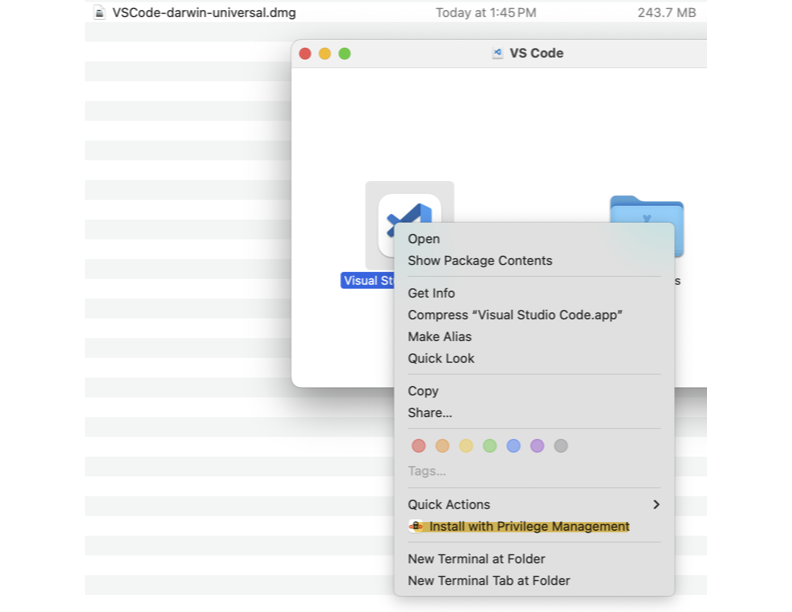

# Goal : Install VSCODE, Java, and PySpark sto Mac machine at BAH.

### Assumption : The Mac is connected to the VPN or on the BAH's secured network. The  

1. Download the VSCODE for Mac.

https://code.visualstudio.com/Download?ref_product=copilot&ref_type=engagement&ref_style=text

2. Keep the downloaded file - "VSCode-darwin-universal.dmg" to the Desktop
    * One need to double click on the dmg file and open the window.
    * Install the application using the privilege access. See the image. install_vscode_previlege.png

    


3. After the successful installation open the vscode app.

4. The installation of java requires the download. ***The VPN/BAH network was not working. So I had to disconnect and download through the terminal***
    * I have open the Terminal window of the vscode app and expected the following command.

    ```
    milindchokshi@L5QPXK990L Downloads % brew install openjdk
    ```
    * Once install check for the open JDK
    ```
    milindchokshi@L5QPXK990L Downloads % brew info openjdk
    ```
    * Export the path to .zshrc
    ```
    milindchokshi@L5QPXK990L Downloads % echo 'export PATH="/opt/homebrew/opt/openjdk/bin:$PATH"' >> /Users/milindchokshi/.zshrc
    ```
    * Export JavaHOme to .zshrc file
    ````
    echo 'export JAVA_HOME="/opt/homebrew/opt/openjdk/libexec/openjdk.jdk/Contents/Home"' >> ~/.zshrc
    ```
    * Soruce the .zshrc and it will keep the java installation in the path for VSCODE to find
    ```
    milindchokshi@L5QPXK990L Downloads % source ~/.zshrc
    ```
5. Create virtual environment and activate for python
    ```
    milindchokshi@L5QPXK990L Downloads % source .venv/bin/activate
    ```
6. Upgrade the pip to install the python libraries. One should see the venv on the prompt for the location. BAH does not allow to have python install on the default prompt so it needs the virtual environment.
    ```
    (.venv) milindchokshi@L5QPXK990L Downloads % /Library/Developer/CommandLineTools/usr/bin/python3 -m pip install --upgrade pip
    ```
7. Install Pysprak and other libraries as needed for the project.
    ```
    (.venv) milindchokshi@L5QPXK990L Downloads % pip3 install pyspark
    
    Requirement already satisfied: pyspark in ./.venv/lib/python3.9/site-packages (4.0.2)
    Requirement already satisfied: py4j<0.10.9.10,>=0.10.9.7 in ./.venv/lib/python3.9/site-packages (from pyspark) (0.10.9.9)
    ```
8. ***Connect to the VPN/BAH network after successful installation. For some reason, I was unsuccessful when I was on the secure network.***


